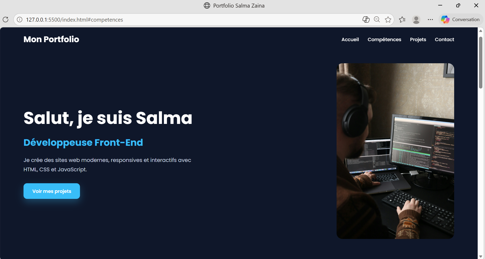
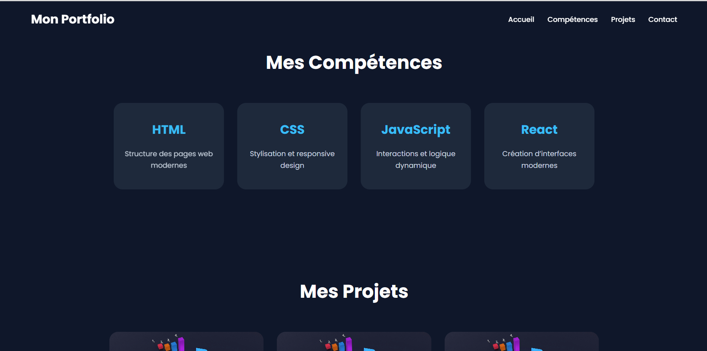

# 🌐 Portfolio - Salma Zaina

## 📖 Description du projet

Ce projet est un portfolio personnel développé dans le cadre du projet final du cours JavaScript.

L’objectif est de présenter mon profil, mes compétences et mes projets à travers un site web moderne, responsive et interactif.

Le site met en pratique :
- HTML5
- CSS3
- JavaScript
- Responsive Design
- Manipulation du DOM
- Gestion des événements
- Programmation asynchrone avec fetch API

---

## 🚀 Fonctionnalités principales

✅ Navigation responsive  
✅ Menu mobile interactif  
✅ Animation au scroll  
✅ Cartes de compétences et projets  
✅ Formulaire de contact interactif  
✅ Intégration API GitHub avec fetch()  
✅ Design moderne et responsive  

---

## 🛠️ Technologies utilisées

- HTML5
- CSS3
- JavaScript Vanilla
- Git & GitHub
- GitHub Pages
- Figma

---

## 📂 Structure du projet

portfolio_salma_zaina/
│
├── index.html
├── README.md
├── css/
│ └── style.css
├── js/
│ └── main.js
└── assets/
└── images/

---

## 📸 Capture d’écran

---

## 🎨 Maquette Figma
https://www.figma.com/design/LhDFGh3A8zeuwJnHXGbX5l/Untitled?node-id=0-1&t=q35MXgTK1ZLSCFLd-1

## 🌍 Version en ligne
https://github.com/Salma-ai-prog/portfolio_Khourge_Salma

---

## 📚 Ce que j’ai appris

Grâce à ce projet, j’ai appris :

- Créer une interface responsive
- Utiliser JavaScript pour rendre un site interactif
- Manipuler le DOM
- Gérer des événements utilisateur
- Utiliser fetch() et async/await
- Publier un projet sur GitHub Pages

---

## 👩‍💻 Auteur

Projet réalisé par Khourge Salma et Zaina Sabri.
